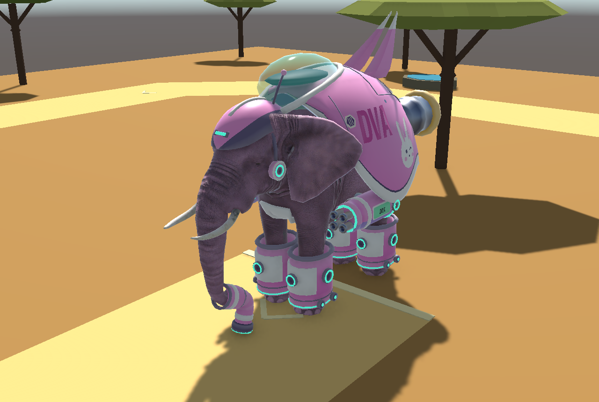
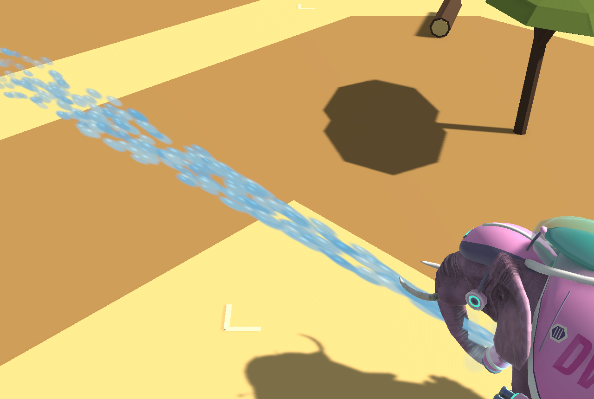

# eva大象：D.Va 风格机甲大象

给 DigiPhant 大象穿上一套可爱的粉色机甲（参考 Overwatch D.Va 的 MEKA）。大象的模型和动画不变，机甲是挂在骨骼上的独立零件，会跟着走路动画和手势控制一起动。



## 包含什么

| 部分 | 说明 |
| --- | --- |
| 机甲 | 背甲（接缝、六边形散热口、DVA 字样、兔子贴纸、GG 贴纸）、玻璃驾驶舱、尾翼、两个喷射口、背甲下沿两侧的炮舱（侧面贴 DIVA 绿色铭牌）、胸甲、四条腿甲、头盔加耳机和天线、鼻尖弯头水枪 |
| 糖果粉皮肤 | 只给皮肤叠一层淡粉，象牙和眼睛保持原色（`Textures/Elephant_D_Candy.jpg`） |
| 四款涂装 | 只换颜色不换模型：经典糖果、紫晶夜色（紫黑金、橙灯）、青瓷晴空（瓷白天蓝古铜、青灯、琥珀玻璃）、樱桃校园（亮粉白银、绿灯）。每款一张调色板材质，连大象肤色和火焰颜色一起换（`DivaMechSkins`） |
| 鼻尖水枪 | 水柱、水雾、落地水花、喷口闪光、开喷/持续/停喷音效 |
| 泡泡炮 | 两门炮喷彩虹肥皂泡，会飘、会上浮、落地破掉 |
| 推进器火焰 | 跟移动速度联动：站着不喷，走路小火，跑起来大火，加速时多一点爆发；引擎声跟着变大变高 |
| 音效 | 脚步（脚抬起再落地时播放）、水枪、泡泡、喷射口嗡鸣。全部用程序合成，没有录音素材 |

## 已经装好的场景

`Assets/DigiPhant/Scenes/Diva.unity` 里的大象已经装上了。在 Hierarchy 选中 `Elephant Travel` 可以看到这些组件：

- `DivaMechToggle`：**Show Mech** 开关整套机甲，**Candy Skin** 开关糖果粉皮肤。
- `DivaMechSkins`：四款涂装，**Start Skin** 选开局用哪款；脚本里调用 `Apply(序号)` 或 `Next(±1)` 切换（选涂装界面就是这样做的）。
- `DivaBoosters`：推进器火焰。**Boost Override** 设成 0~1 可以固定火焰大小来测试，-1 表示跟随速度。
- `DivaBubbleCannons`：勾选 **Blowing** 喷泡泡。
- `DivaMechAudio`：脚步和嗡鸣的音量。
- `DivaMechGestureLink`：把 Diva 手势接到水枪和泡泡上，可以分别关掉（见 GESTURES.md）。
- 水枪在 `DivaMech Trunk Blaster`（大象鼻尖骨骼下面）上的 `DivaTrunkBlaster`，勾选 **Spraying** 喷水。

## 装到别的场景

打开有 DigiPhant 大象的场景，保存，然后点菜单 **Diva > Add D.Va Mech to Elephant**。

- 重复点会替换旧零件，不会装两套。
- **Diva > Remove D.Va Mech**：移除机甲，并恢复大象原来的皮肤。
- **Diva > Capture D.Va Mech Screenshots**：拍预览图，存到项目根目录的 `work/diva-mech-shots/`。
- **Diva > Rebuild D.Va Mech Skins**：只重新生成四款涂装的材质（颜色在 `Editor/DivaMechBuilder.cs` 的 `SkinDefs`），不重建零件。

## 手势和动画对照

完整的触发逻辑（识别条件、阈值、时序）见 **[GESTURES.md](GESTURES.md)**。

| 玩家 | 手势 | 游戏里的作用 | 机甲大象的动画和特效 | 联动 |
| --- | --- | --- | --- | --- |
| P1 | 双臂举起上下摆 | 前进 | 走路/跑步动画、脚步声、推进器火焰和引擎声随速度变大 | ✅ 自动（读移动速度） |
| P2 | 双手和身体往左/右倾 | 转向 | 转向动画；有速度时火焰照常 | ✅ 自动 |
| P3 | 举起左手或右手 | 瞄准 | 水枪的水柱跟着往左/右 | ✅ `DivaMechGestureLink` |
| P3 | 双手张开往前推 | 喷水打靶 | 鼻尖水枪喷水（弹道和打靶判定一致；原来的蓝色小球默认隐藏，照样计分） | ✅ `DivaMechGestureLink` |
| P3 | 双手合在嘴边 | 喝水补水箱 | 两门泡泡炮冒泡泡 | ✅ `DivaMechGestureLink` |
| 原 DigiPhant 场景 | 抬手/抬脚 | 腿抬起 | 腿甲跟着腿动、落地有脚步声 | ✅ 自动 |



## 自己写脚本触发

Diva 场景里已经由 `DivaMechGestureLink` 接好手势。在别的场景或想换手势时，可以直接调用：

```csharp
var root = elephantTravel; // 场景里的 Elephant Travel
var water = root.GetComponentInChildren<Diva.DivaTrunkBlaster>();
water.StartSpray(); water.StopSpray(); water.Burst(0.8f); water.SetPressure(0.7f);

var bubbles = root.GetComponent<Diva.DivaBubbleCannons>();
bubbles.StartBubbles(); bubbles.StopBubbles(); bubbles.Burst(1.5f);

var boost = root.GetComponent<Diva.DivaBoosters>();
boost.SetBoost(1f);   // 固定大火；SetBoost(-1) 回到跟随速度
```

鼻子往前卷（Trunk curl 往负方向）时，枪口朝前；待机时朝下。

## 性能（为 Mac 和 Vision Pro 准备）

- 17,828 个三角面，分成 8 个网格（每根骨骼一个）。
- 换涂装只是换一张调色板材质，不增加三角面和绘制调用。
- 机甲本身 9 次绘制调用：除了玻璃，所有零件共用一个调色板材质（`Generated/Mech Atlas.mat` 加 128×32 的调色板贴图）。顶点上存了明暗值，用来做掉漆、凹处和下部偏暗的效果，不需要展 UV。
- 粒子：水枪约 260/秒（只在喷水时），泡泡每门炮 22/秒（只在喷泡泡时），火焰每个喷射口最多 230/秒（只在移动时）。

## 文件

| 路径 | 内容 |
| --- | --- |
| `Data/diva_mech.bytes` | 机甲几何数据（Blender 导出） |
| `Editor/DivaMechBuilder.cs` | 安装脚本和菜单：读取数据，用大象网格的 UV 对齐，按骨骼的绑定姿势挂上零件，生成材质和特效 |
| `Runtime/` | 运行时组件（开关、火焰、泡泡、水枪、音效） |
| `Generated/` | 安装时生成的网格、材质、调色板和粒子贴图 |
| `Audio/` | 合成音效 |
| `Textures/Elephant_D_Candy.jpg` | 糖果粉皮肤贴图 |
| `Source~/` | 生成用的源脚本（Unity 不会导入以 `~` 结尾的文件夹） |
| `Docs~/` | 预览图 |

## 重新生成模型、音效或皮肤

在 Blender 4.1 里重新导出机甲（需要 starter 里的 `Elephant/Animations/elephant@idle.fbx` 和两张大象贴图）：

```bash
LETTER_SIZE=.92 EXPORT=$PWD/diva_mech.bytes blender -b --factory-startup --python "Assets/eva大象/Source~/build_mech.py" -- elephant@idle.fbx Elephant_D.png Elephant_N.png "Assets/eva大象/Source~/SairaExtraCondensed-Bold.ttf" out hero,side
```

把生成的 `diva_mech.bytes` 放进 `Data/`，再点一次 **Diva > Add D.Va Mech to Elephant**。

- 音效：`python make_sounds.py 输出文件夹`
- 皮肤：`python make_candy_texture.py Elephant_D.png Elephant_D_Candy.jpg`

## 许可

- 字母字体是 Saira ExtraCondensed Bold（SIL OFL，见 `Source~/OFL-Saira.txt`），用来近似 Overwatch 的 Big Noodle Titling Oblique。Big Noodle 是商业字体，所以没有放进来。
- 音效全部由 `Source~/make_sounds.py` 合成。
- 没有使用 Blizzard 的标志（MEKA、D.Va 签名、兔子 logo），兔子和贴纸都是自己画的。"DVA"、D.Va、Overwatch 是 Blizzard 的商标，课堂项目里用没问题，商用前请换掉。

## 还没测试的

- Play 模式下用真实摄像头控制时的整体表现，以及音效的实际听感。
- Vision Pro：全沉浸模式应该和 Mac 一样；混合现实模式（PolySpatial）下，喷口点光源和部分粒子功能可能不支持，需要在设备上试。
